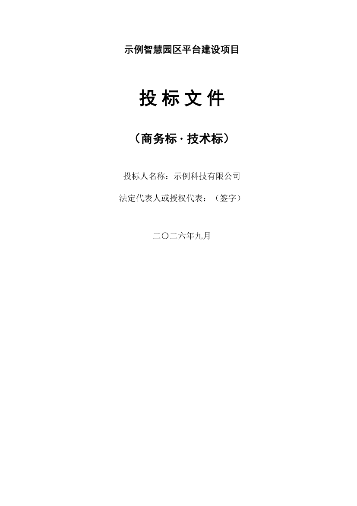
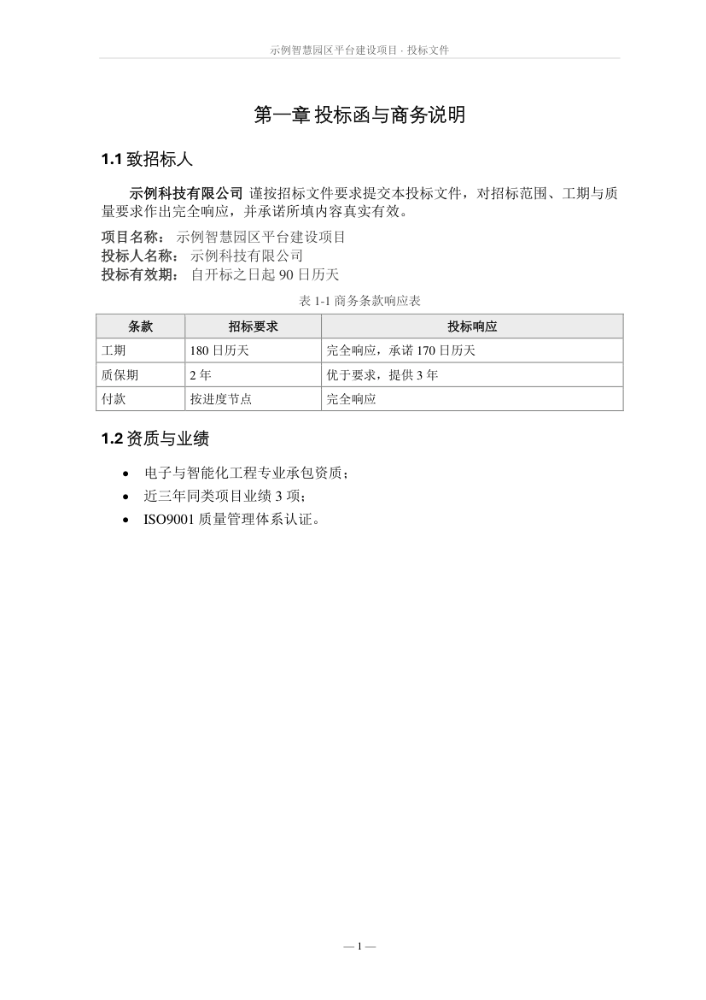
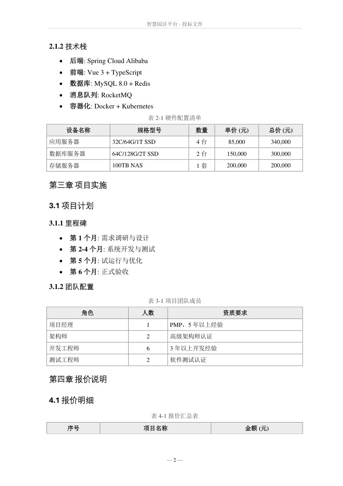
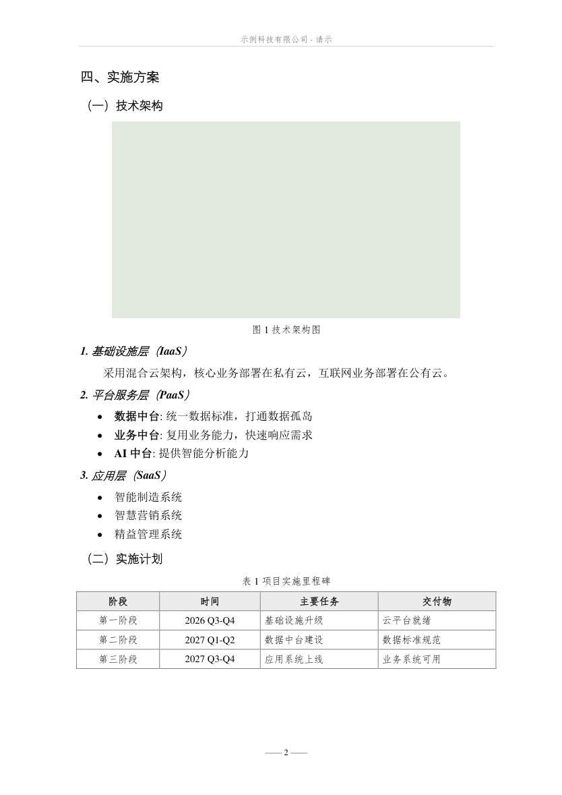
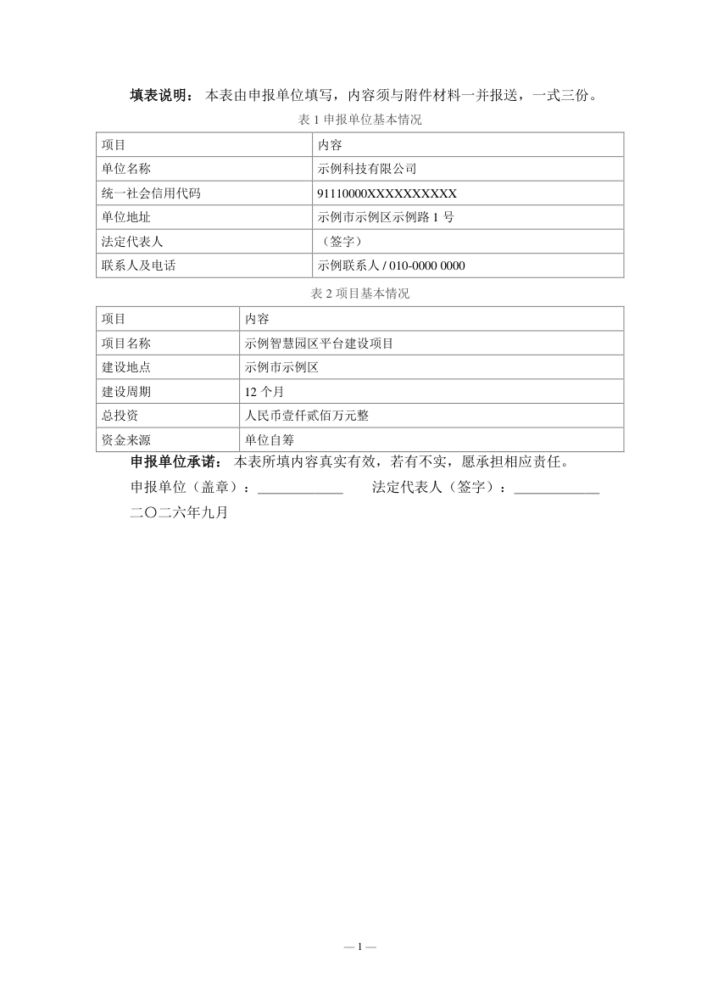
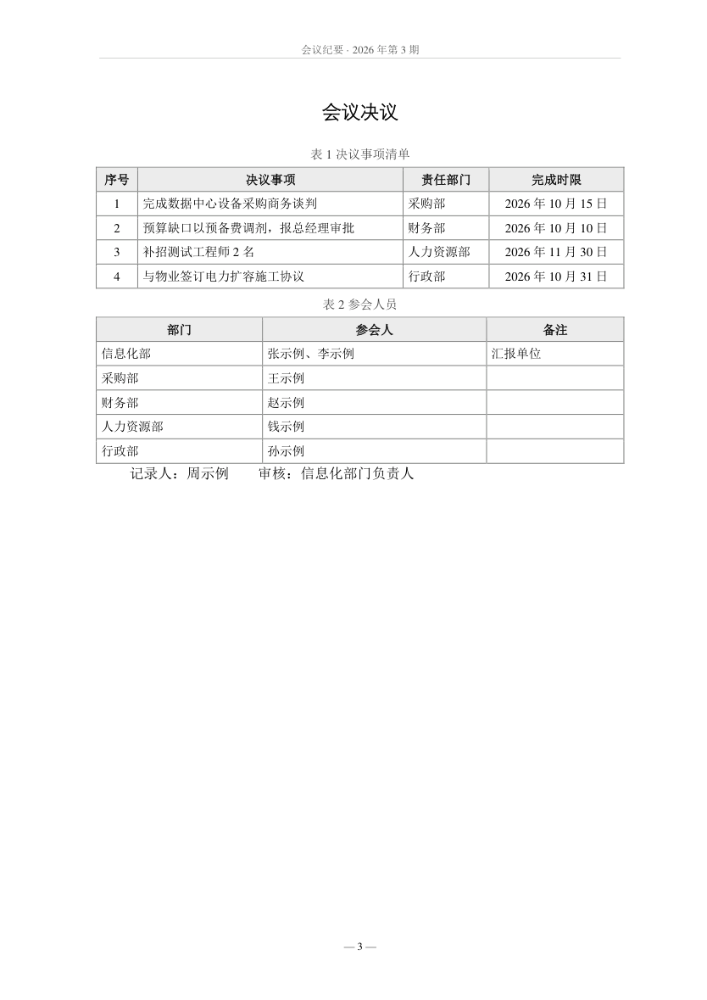
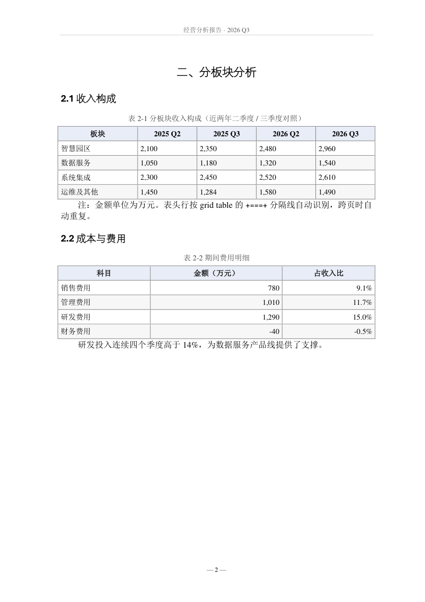
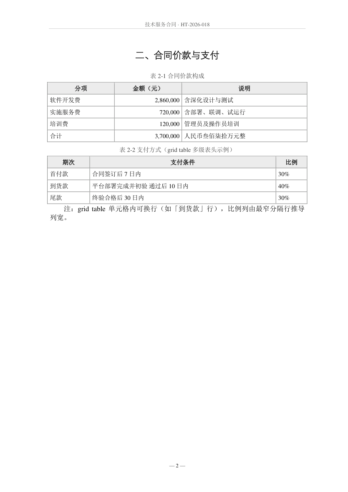
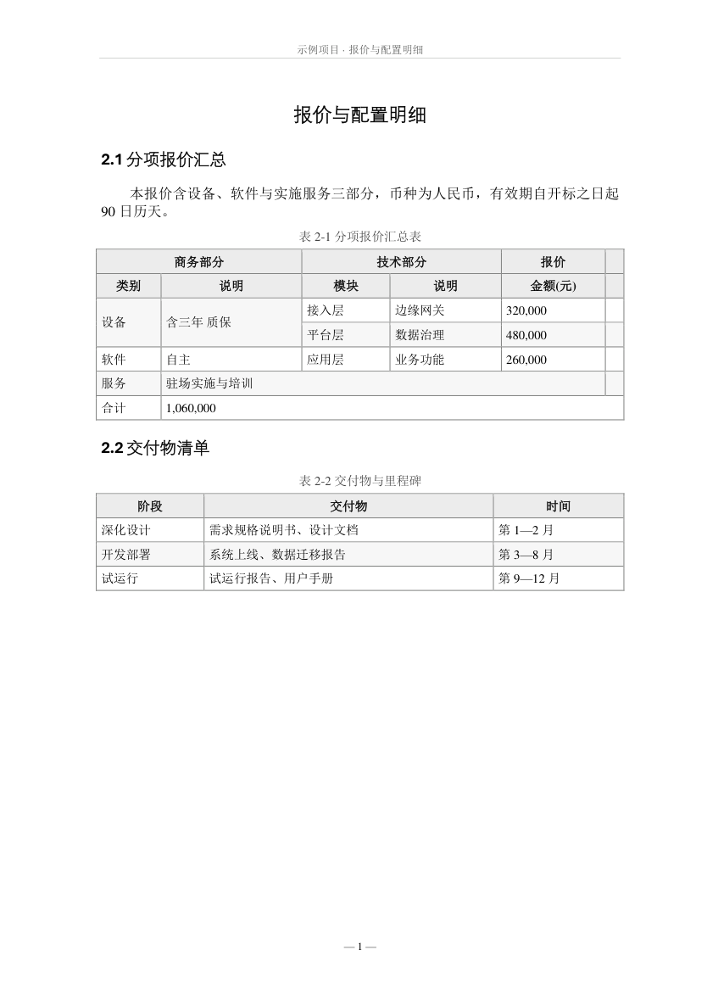

English | [简体中文](README.zh-CN.md)

# texere — the Chinese formal document compiler

> From Latin **texere**, "to weave" — the shared root of *text* and *textile*. Typesetting is the same act:
> body text, tables, captions and page numbers woven into an ordered page.

**Reference/Spec → Deterministic Document → Evidence**

texere is a **high-fidelity document compiler** for Chinese formal documents (tenders, grant applications,
official reports). Given a Markdown source and a reference template (`ref.docx` or `profile.json`), it produces
a Microsoft Word document that has been **verified in real Word**, exported to PDF, and checked for layout drift —
with an evidence package proving it's delivery-ready.

> **Platform**: Windows + a local Microsoft Word install. Everything past the docx — Word acceptance, PDF export,
> the 9-check validator — runs through Word COM. On Linux/macOS only the docx half works (see
> [Known limitations](#known-limitations)).

**Contents** · [Three pillars](#three-pillars) · [Scope](#what-it-does-and-doesnt-do) ·
[Documentation map](#documentation-map) · [Quick start](#quick-start) · [Result](#result) ·
[Usage](#usage) · [Validation](#validation-and-evidence-package) · [Editing a docx](#editing-an-existing-docx) ·
[Reusing a template](#reusing-an-existing-template) · [Configuration](#configuration) · [Tables](#tables) ·
[Bid notes](#tenderbid-notes) · [Design principles](#design-principles) ·
[Known limitations](#known-limitations) · [Development](#development) · [Repository map](#repository-map)

## Three pillars

1. **Compiler, not converter** — Markdown → Semantic IR → Layout Spec → DOCX. Every visual rule is explicit
   in a design contract (`ref.docx` + `profile.json`), not magic.
2. **Contract, not guesswork** — The profile declares fonts, spacing, borders, headers, footers, captions.
   Agents can read it; humans can audit it. No hidden assumptions.
3. **Evidence, not hope** — One command validates everything: package integrity, image embedding, TOC fields,
   page numbering, blank pages, Word acceptance, visual drift. Output: `report.json` + screenshots + signature.

## What it does and doesn't do

**Does**

- Markdown → docx / PDF, with cover page, TOC field, per-section page numbers and headers
- Table typesetting — borders, header rows, repeating headers, zebra stripes
- Caption conventions for tables and figures
- One-command pre-delivery acceptance: does Word open it, are there blank pages, did the layout drift
- **Targeted edits to an existing docx** — text, paragraphs, table cells, headers/footers — without
  re-typesetting the rest

**Doesn't**

- Comments, tracked changes, redaction, accessibility work, watermarks on an existing docx —
  use a general-purpose docx skill for those
- Automatic figure numbering — numbers are hand-written (see [Contract](#contract-layout-only-never-content))
- Thesis features: bibliography, equation numbering, odd/even page headers

## Documentation map

Every piece of information lives in exactly **one** place; the other files link instead of duplicating
(drift has bitten us before, so the parts that can be machine-checked are enforced by `tests/test_docs_sync.py`):

| File | Owns |
|---|---|
| `README.md` (+ `.zh-CN` mirror) | The human manual: config fields, `style` keys, table syntax, input rules, known limitations |
| `SKILL.md` | Agent entry: when to use / not, hard contract, acceptance gate, Patch schema, pitfalls |
| `BEST_PRACTICES.md` | Scenario experience: profile choice, styling recipes, debugging cases, FAQ |
| `docs/SCRIPT_HELP.md` | Per-script CLI reference (**the** single source for every option; guarded against the code by `tests/test_docs_sync.py`) |

So: **this manual never lists a CLI flag table** — it shows the commands you'll actually run and points at
SCRIPT_HELP for the rest. `test_docs_sync.py` fails the commit if a script grows an option that isn't
documented there, or if SCRIPT_HELP invents one that doesn't exist.

> **Scope note.** This tool is opinionated about *Chinese* formal documents: A4 paper, 宋体 (SimSun) body text,
> 黑体 (SimHei) headings, 2-character first-line indent, full-width punctuation. It is not a general
> Markdown → docx converter — that is what pandoc is. Enabling the `caption_words` option lets you
> work with non-Chinese caption keywords, but the typographic defaults stay Chinese.

## Quick start

External dependencies: `pandoc` is required; `--pdf` and the validator need a local Microsoft Word.

| Dependency | Purpose | Install |
|---|---|---|
| pandoc >= 3.1 | **Required**, md → docx | `winget install --id JohnMacFarlane.Pandoc` |
| python-docx, lxml | **Required**, docx I/O and OOXML handling | see below |
| pywin32 | `--pdf` only (Word acceptance + PDF export) | see below |
| PyMuPDF | `--check` only (PDF visual acceptance) | see below |
| Microsoft Word | `--pdf` only | system-level; neither pip nor uv can install it |

> **This repository is a collection of scripts, not a pip-installable package** — `pip install .` fails
> (there is no build backend, and the tool resolves `assets/ref.docx` / `scripts/` / `assets/sample.md` by
> relative path from each script's own location).
> Put the folder anywhere and run the scripts in place.

```powershell
winget install --id JohnMacFarlane.Pandoc

# Dependencies:
pip install -r requirements.txt      # plain pip; versions are exported from uv.lock
                                     # (uv users: `uv sync --all-extras`)

python scripts/render.py --doctor            # environment self-check
python scripts/render.py --sample            # smoke test -> sample_out.docx/.pdf
```

`--doctor` **identifies the Word engine by actually launching it via COM**. It does not read the registry:
a stale `CurVer` key left over from an uninstalled Office can make that report lie.
Contributor tooling (ruff, pre-commit, the test suite) is in [Development](#development).

## Result

Output of `python scripts/render.py --sample` (a 4-page tender-style sample):




### Examples gallery

Real rendering results from [`examples/`](examples/README.md) — every directory ships its Markdown +
config and runs with one command; regenerate these images with `python scripts/make_previews.py`.

| Tender (`tender/`) | Official document (`gongwen/`) |
|---|---|
|  |  |
| Application form (`form/`) — no headings, no TOC, field-name first rows | Meeting minutes (`minutes/`) — cover carries the meeting metadata |
|  |  |
| Business analysis report (`report/`) — multi-file merge, Lead callout, grid header | Contract (`contract/`) — clause sections, in-cell line breaks, signature block |
|  |  |
| Table styling (`tables/`) — multi-level headers, merged cells, column widths | |
|  | |

**Measured throughput** (Word acceptance + PDF export + blank-page check included):

| Size | Time |
|---|---|
| 69 pages / 63 tables / 28 images | **19.0 s** |
| 272 pages / 252 tables / 112 images | **69.7 / 66.9 s** (two consecutive runs) |

The large run produced a 2.9 MB docx; both runs matched item by item (page count, word count, tables, images,
and sampled page pixels), with no orphaned Word processes.

## Usage

The five flows you'll actually run; every flag for every script lives in
[`docs/SCRIPT_HELP.md`](docs/SCRIPT_HELP.md).

```bash
# 0. Environment
python scripts/render.py --doctor                                # self-check: pandoc / deps / Word engine
python scripts/render.py --sample                                # smoke test -> sample_out.docx/.pdf

# 1. Render Markdown → DOCX + PDF + visual check (--check implies --pdf)
python scripts/render.py --src chapters/ --out bid.docx --config cfg.json --pdf --check

# 2. Accept before delivery (9 checks → report.json + screenshots + signature)
python scripts/validate.py bid.docx --out evidence/
python scripts/validate.py bid.docx --profile profiles/formal-cn-v1.json   # + visual drift vs baseline

# 3. Edit an existing docx (targeted; the editing chain, opposite contract)
python scripts/edit.py bid.docx --replace "工期=进度" --verify
python scripts/edit.py bid.docx --fill data.json                 # batch table filling

# 4. Declarative Patch (Agent-friendly: dry-run, hash preconditions)
python scripts/patch.py bid.docx patch.json --dry-run
python scripts/patch.py bid.docx patch.json --apply --validate

# Supporting cast
python scripts/distill.py 甲方模板.docx --out cfg.json           # template → suggested config
python scripts/make_ref.py --body-font 楷体 --body-size 14       # rebuild the typesetting template
python scripts/snapshot.py bid.pdf --update                      # record baseline (after confirming layout)
python scripts/snapshot.py bid.pdf                               # regression compare; exit 1 on drift
python -m pytest -q                                              # 161 assertions, ~6-7 min (needs local Word)
```

Runnable examples — each directory ships its Markdown + config and runs with one command
(see [examples/README.md](examples/README.md)):

```bash
python scripts/render.py --src examples/tables --out examples/tables/tables.docx \
       --config examples/tables/config.json --pdf --check
```

### Input requirements

- Put `01_xxx.md … 0N_xxx.md` in the source directory; they are merged **in filename order**.
  `#` is a chapter, `##` a section. A single `.md` file works too (`--src notice.md`) — no need to
  create a directory for a one-pager.
- Table captions are their own line: `表 1-1 Caption` (centred and greyed automatically). Figures:
  `{width=13cm}`.
- **Image search path**: the `src` directory, all of its subdirectories, and **the parent of `src` plus that
  parent's subdirectories** are added automatically; add more with `resource_paths`. The render prints
  `images: n/m ok`, and reports `[ERROR]` if the source references images that were not embedded.
- Cover and header are configured in the config file; without a `cover` only the TOC is injected.
  **Note**: after injecting cover lines, `post.py` appends one blank `CoverInfo` paragraph itself — so do
  not put leading/trailing blank lines in the config, or the cover overflows onto a second (blank) page.
- Emphasis is `**bold**`; a grey callout box is `::: {custom-style="Lead"} … :::`.
- **Do not put content before the first `#`** (a title-like phrase, say): it is neither treated as a cover
  nor kept in place — it ends up after the TOC. `post.py` prints a `[warn]` listing it, but will not delete
  it for you (the contract forbids changing content).
- config.json and source `.md` files may carry a UTF-8 BOM (Windows Notepad writes one by default).
- **Form-style / appendix documents** (no `#` headings) are supported: no TOC, no section split, just cover
  and table/caption typesetting. Their tables usually start with field names rather than column headers, so
  set `"style": {"header_rows": 0}` to keep the first row from being shaded as a header.

### Contract: layout only, never content

`post.py` does not touch **any** of the text in the body or the captions. Figure and table numbers are
hand-written in the source.

Version 0.2.0 briefly shipped an "automatic figure numbering + `@tab:` cross-references" feature. It was
**removed entirely** because it rewrote caption text, added numbers to captions that had none, and left
hand-written in-text references out of sync. If numbering is ever revisited, the right implementation is
Word's native `SEQ` / `REF` fields (updatable, no text rewriting) — not rewriting caption text.

## Validation and evidence package

After rendering, one command turns "I think it's fine" into an auditable artifact:

```bash
python scripts/validate.py bid.docx --out evidence/
```

This produces:

```
evidence/
├── report.json          # Structured validation report (9 checks)
├── page-001.png         # Sample screenshots (first, middle, last pages)
├── page-069.png
├── page-272.png
└── signature            # SHA256 hash + check summary
```

The report contains 9 automated checks:

| Check | What it verifies |
|---|---|
| ✅ Package integrity | DOCX is a valid ZIP with required parts |
| ✅ Source content integrity | Optional hash verification against expected value |
| ✅ Image embedding | All referenced images are embedded (n/m ok) |
| ✅ Section count | Reasonable number of sections (1–100) |
| ✅ TOC field | Table of contents exists and can be updated |
| ✅ Page numbering | Pages are continuous, no gaps |
| ✅ Blank pages | Below threshold (default: 0 allowed) |
| ✅ Word acceptance | Real Word opens and exports PDF successfully |
| ✅ Visual baseline drift | Pixel comparison against baseline (if provided) |

Example output:

```
Document Validation
────────────────────────────
✅ [PASS] package_integrity: OK
✅ [PASS] source_content: Skip (未提供 expected_hash)
✅ [PASS] image_embedding: 图片嵌入：28/28 ok
✅ [PASS] section_count: 分节数：3 (合理)
✅ [PASS] toc_field: 目录域：存在 (Table of Contents 1)
✅ [PASS] page_numbering: 页码：69 页 (连续)
✅ [PASS] blank_pages: 空白页：0/69 (阈值：0)
✅ [PASS] word_acceptance: Word 验收：OK
✅ [PASS] visual_drift: 视觉基线：一致

Summary
────────────────────────────
Passed: 9/9

✅ All checks passed

Evidence package saved to: evidence/
  - report.json (structured validation report)
  - page-XXX.png (sample screenshots)
  - signature (SHA256 signature)
```

If any check fails, exit code is 1 and you get a detailed error message. Flags
(`--profile`, `--max-empty`, `--quiet`, …): `docs/SCRIPT_HELP.md` §validate.py.

### Manual gate

The 9 checks cover structure; four things stay human, on the first pass over any new document:

1. `images: n/m ok` in the render log with **n == m** (m = count of `![` in the source)
2. `near-empty pages: 0`
3. `OK` — Word opened it and exported the PDF
4. **Look at the rendered pages.** Machines count pages, images and blanks; they can't tell you the figure is
   wrong or the header row got clipped

## Editing an existing docx

`scripts/edit.py` is a **separate chain** from rendering, with the opposite contract:

| | Rendering chain | Editing chain |
|---|---|---|
| Input | Markdown | an existing docx |
| Contract | layout only, never content | **change only what is asked; leave every other byte alone** |
| Never | rewrite text | inject a cover, TOC, page numbers, or re-typeset styles |

The shapes of the operations (full option list: `docs/SCRIPT_HELP.md` §edit.py):

```bash
python scripts/edit.py 标书.docx --list                      # structure: sections / tables / paragraphs
python scripts/edit.py 标书.docx --replace "旧=新" --scope body,tables,header,footer
python scripts/edit.py 标书.docx --after "锚点文字" --text "新段落"   # also --before / --delete
python scripts/edit.py 标书.docx --cell 0 2 1 "1,060,000"            # table / row / col / value
python scripts/edit.py 标书.docx --add-rows 0 3 --template-row 2     # also --add-row / --del-row
python scripts/edit.py 标书.docx --fill data.json                    # batch fill, JSON or CSV
python scripts/edit.py 标书.docx --header "新版页眉" --footer "— X —" --section all
python scripts/edit.py 标书.docx --replace "A=B" --verify            # let Word open the result
```

Backups go to `<name>.bak.docx` by default (`--no-backup` disables, `--out` writes elsewhere).

**Why editing in place is safe**: `python-docx` round-trips a docx without losing any part — opening and
saving a 4-page document loses and adds zero package parts (measured; the file only gets smaller because
it is re-zipped).

**Two traps worth knowing**

1. *Word splits text into runs unpredictably.* `自开标之日起 90 日历天` can be three runs with the number
   on its own, so a naive `run.text` search misses it. `edit.py` matches against the whole paragraph text
   and writes the replacement into the run where the match starts, so the run count and each run's
   formatting survive.
2. *An anchor matching several paragraphs is refused.* Once Word refreshes a TOC field, a heading like
   `1.2 资质与业绩` exists both in the TOC and in the body; inserting after it would put content into the
   table of contents. Use a more precise anchor, or pass `--all-anchors`.

**Not supported, deliberately**: tracked changes, comments, watermarks, content controls, and `.docm`
files with macros (`python-docx` drops `vbaProject.bin` on save).

### Re-typesetting instead of editing

To bring someone else's docx into this project's format, go through Markdown — but clean it first:

```bash
pandoc 甲方文档.docx -t markdown --wrap=none --extract-media=media -o 01_内容.md
# 手工清理：删掉原来的封面行与目录块、去掉表头残留的 ** 加粗
python scripts/render.py --src . --out 新版.docx --config cfg.json --pdf --check
```

Measured on a 4-page document: without cleaning, the result has a **duplicated cover and TOC**, leaks
`[1](#...)` link syntax into the body, and grows from 4 to 5 pages. Image references from
`--extract-media` are relative to the working directory, so run from the repository root or put `media/`
inside `--src`.

## Reusing an existing template

Point `reference_doc` at any docx — a client-mandated bid template, or one of your own — and **more is
inherited than the previous README claimed**. Measured with a template carrying 3 cm margins, 楷体 14pt
body text and a custom header:

| In the template | Inherited? | Condition |
|---|---|---|
| Page setup (paper size, orientation, margins) | ✅ | automatic |
| Body / heading / table / caption styles (font, size, colour, spacing) | ✅ | automatic |
| **Header** | ✅ | **as long as you do not set `header` in config** |
| Footer / page numbers | ⚠️ | always rewritten — see below |
| Cover | ❌ | `post.py` injects its own |
| Section structure | ❌ | rebuilt as "cover + TOC" / "body" |

```json
{
  "reference_doc": "甲方模板.docx",
  "style": { "page_number": null }
}
```

**Footers**: by default the page number is *appended* to whatever the template already has
(`文件编号 XYZ-2026— 1 —`). To keep the template footer exactly as it is, set `"page_number": null`.

**Inspect a template before using it** — distill it:

```bash
python scripts/distill.py 甲方模板.docx                  # report + suggested config
python scripts/distill.py 甲方模板.docx --out cfg.json    # also write the config
```

The report lists page setup, body/heading fonts, per-section headers and footers, and prints the matching
`make_ref.py` command if you would rather rebuild your own template than reference theirs. Cover structure,
page-number format and table styling cannot be inferred — they are listed as items to confirm by hand.

> **Distillation, not conversion.** The script does not try to "understand" a template. It splits the
> template into config fields and lets you decide — the same division of labour as the rest of the tool.

## Configuration

### config.json fields

| Field | Purpose |
|---|---|
| `cover` | Cover lines `[[style_name, text], …]`; style names: CoverTop / CoverTitle / CoverSub / CoverInfo / CoverDate |
| `header` | Header text for the body section |
| `title` / `author` / `subject` / `comments` | Document properties |
| `reference_doc` | Use a specific template docx (for a client-mandated format) |
| `toc_heading` | TOC title, default 「目　　录」 |
| `toc` | `false` → no TOC page (short notices / announcements); headings keep their styles, and with no cover the document stays a single section |
| `style` | Fine-grained layout, see below |
| `caption_words` | Custom caption keywords (default 表/图/Table/Figure), see below |
| `resource_paths` | Extra directories to search for images |
| `content_fixes` | Editorial replacement table `[[old, new], …]`, applied after merging and before conversion |
| `content_fixes_file` | Replacement table file (`.json`, or the `CONTENT_FIXES` literal inside a `.py`; relative paths resolve against the config file's directory) |

> `content_fixes` is for dropping explanatory parentheticals or unifying wording. When it points at an
> existing `.py`, the values are read with `ast` — **parsed, never executed** — so you don't have to keep a
> second copy of the rules.

`caption_words` (only needed for non-Chinese or unusual caption keywords; `post.py` and the Lua filter are
kept in sync):

```json
"caption_words": {"table": ["表", "表格"], "figure": ["图", "图片"]}
```

### The `style` section

**This table is the single source for `style` keys and their defaults** — other sections link here instead of
restating them. Everything is optional; the defaults are the Chinese formal-document conventions:

| Group | Keys | Default |
|---|---|---|
| Footer | `page_number` / `page_number_size` | `— {n} —` / `9` |
| Header | `header_size` / `header_gray` / `header_rule_color` / `header_rule_size` | `9` / `595959` / `BFBFBF` / `4` |
| TOC | `toc_depth` / `toc_title_size` / `toc_title_color` / `toc_placeholder` / `toc_placeholder_size` | `1-2` / `16` / `000000` / see source / `12` |
| Captions | `caption_gray` / `caption_size` / `caption_space_before` / `caption_space_after` | `404040` / `10.5` / `6` / `4` |
| Captions | `caption_keep_with_next` | `true` (keeps a table caption with its table; turning it off saves a page in testing, but the caption may strand at a page foot) |
| Tables | `header_rows` | auto — **per table**, by reading the `w:tblHeader` pandoc emits; a number forces it; `0` = this table has no header (forms / appendix tables whose first row is a field name), which also drops the repeating-header flag. See [Visual control](#visual-control) |
| Tables | `table_border` / `table_shade` / `table_size` | `full` / `EDEDED` / `10.5` |
| Tables | `table_header_color` / `table_zebra` / `table_zebra_fill` | unset / `false` / `F7F7F7` |
| Tables | `cell_margin_v` / `cell_margin_h` / `table_para_space` | `40` / `80` / `1` |
| Tables | `border_size` / `border_color` / `three_line_size` | `6` / `808080` / `12` |
| Fonts | `east_font` / `latin_font` | `宋体` / `Times New Roman` (**tables and captions only**) |

> Colours are 6-digit hex (`404040`); border weights are in 1/8 pt; spacing is in pt; cell margins are in twips.

## Tables

### Two syntaxes, pick per table

| | pipe table | grid table |
|---|---|---|
| Syntax | `\| a \| b \|` | `+---+---+` |
| Multi-level headers | ❌ | ✅ (everything above `+===+` is header) |
| Merged cells | ❌ | ✅ (column and row spans) |
| Line breaks inside a cell | ❌ | ✅ |
| **Column widths** | ❌ all equal | ✅ see below |
| Column alignment | ✅ `:--` `:-:` `--:` | ❌ |

Use pipe tables for simple lists and price tables; **use grid tables for complex headers, merged cells, and
when you need to control column widths**.

### Grid tables: the three tricks

**1. Multi-level headers + merged cells** — `+===+` separates header from body; omitting an inner `|` on a
row means the cell spans columns:

```
+------------------+------------------+
| 商务部分         | 技术部分         |
+--------+---------+--------+---------+
| 条款   | 响应    | 模块   | 说明   |
+========+=========+========+=========+
| 工期   | 完全响应| 接入层 | 设备   |
+--------+---------+--------+---------+
```

**2. Column widths** — pandoc derives widths from the **narrowest column separator**. The narrowest row above
is `+--------+---------+` (8/9/8/9), and the four columns come out 8:9:8:9 (measured 990/1100/990/1100 twips).
Want a narrow "No." column? Write it narrow.

**3. Line breaks inside a cell** — just write multiple lines in the cell (pipe tables cannot).

### Visual control

Defaults live in [The `style` section](#the-style-section); this is the *when do I reach for it* half.

- **`header_rows`** — the only key you're likely to set per document. Leave it alone and each table's header is
  detected from the source (everything above `+===+` in a grid table). Set `0` for form-style tables whose first
  row is a field name, not a column title — that also stops the header from repeating across pages.
- **`table_border: "three"`** — three-line (booktabs) look for analytical tables; `none` for layout tables that
  shouldn't read as data. Rule weight comes from `border_size` / `three_line_size`.
- **`table_shade` + `table_header_color`** — on a dark fill, pair them (`table_header_color: "FFFFFF"`), or the
  header text disappears against its own background.
- **`table_zebra`** — alternate row shading for wide tables; the first data row stays white.
- **Repeating headers need no configuration**: pandoc already sets `w:tblHeader` on header rows. The line in
  `post.py` is just idempotent hardening.

## Tender/bid notes

1. **When the client mandates a template, theirs wins** — see
   [Reusing an existing template](#reusing-an-existing-template) for what gets inherited. What that section
   can't cover for you: cover sheets, sealing, signature pages and page-number rules still need a manual pass
   against the tender document. This tool does not replace compliance review.
2. The usual bid structure (bid letter / commercial / technical / pricing / credentials) maps directly onto
   `#` chapters. Keep price tables as pipe tables so they are easy to swap for the client's own table later;
   use grid tables for complex headers.
3. Before delivery, run `--pdf --check` and look through the page images: Word opens it, no blank pages,
   header rows shaded, captions centred. Only then package it.

## Design principles

Follow these when editing the template or hand-writing content:

1. Template-driven: visual rules live only in `assets/ref.docx`; the source text carries semantics.
2. The Chinese quartet: 宋体 body + 黑体 headings + `eastAsia` font attributes + 2-character first-line indent.
3. The table triplet: 100 % width + shaded bold centred header + repeating header row.
4. Captions: centred, one size smaller, grey, **not italic**.
5. CJK/Latin mixing: 宋体 for Chinese, Times New Roman for digits and Latin.
6. Before delivery: open in real Word and look at the rendered pages. Never trust "it read back fine".

## Known limitations

- The TOC is a Word field; if it is not refreshed on first open, select all and press F9 (the document sets
  `updateFields`, so it usually refreshes itself).
- Figure and table numbers are **hand-written**: after inserting or deleting a figure you must renumber
  manually (see [Contract](#contract-layout-only-never-content)).
- **Body and heading font/size live in the template**; change them with
  `python scripts/make_ref.py --body-font 楷体 --body-size 14`. The fonts in the `style` section cover tables and
  captions only.
- **Grid tables are whitespace-sensitive**: the pipe characters must line up exactly, or parsing goes wrong
  (we have hit a stray trailing `|`). Note that pandoc aligns columns by **display width** — a CJK
  character counts as two columns, so "looks aligned in a monospace editor" can still produce a broken
  (single-column) table. Verify by rendering, or align programmatically.
- **Windows + Word bound**: see the Platform note at the top. Parsing and typesetting don't need Word;
  the PDF export and half of the acceptance chain do.
- `--check` also flags pages that are legitimately sparse: the signature block at the end of a form, a
  heading alone before a large table. Those are false positives — relax with `--max-empty N`.
- Snapshot baselines depend on the local Word version and fonts. **After switching machines, re-record with
  `snapshot.py --update`**, or you will see drift everywhere. The threshold is 0.1 % (measured: exporting the
  same document twice gives 0.00 %, changing one header line gives 0.16 %).
- Quarto is not used: its 1.10.x docx output drops table bodies when captions are auto-numbered.

## Development

```bash
pip install ruff pre-commit      # ruff replaces flake8 + black + isort in one fast tool
pre-commit install               # one-time

ruff check scripts/ tests/              # lint
ruff format --check scripts/ tests/     # format
pre-commit run --all-files              # everything below, at once
python -m pytest -q                     # full suite: 161 assertions, ~6-7 min (needs local Word)
```

The pre-commit hook runs the lint/format checks plus a **fast test subset** (`test_version`, `test_docs_sync`,
`test_validate_units`, `test_edit`, `test_snapshot`) that never launches Word, so commits stay quick while the
docs-vs-code guards still bite. Run the full suite manually before pushing.

> **There is no hosted CI.** The suite's acceptance tests drive a real Microsoft Word over COM, which no
> GitHub-hosted runner provides — so this repository is checked locally, by pre-commit, not by a pipeline.
> If you add CI, it can only cover the Word-free subset above.

## Repository map

| File | Role |
|---|---|
| `SKILL.md` | Skill description for other agents (when to use, acceptance gate, hard contract) |
| `scripts/render.py` | Entry point: merge md → pandoc → post.py → (optional) finalize / check |
| `scripts/post.py` | Post-processing: cover injection, TOC field, per-section page numbers, headers/footers, table rules, caption styling; hand-written OOXML inserted in ECMA-376 order |
| `scripts/filters/captions.lua` | pandoc Lua filter: marks table/figure captions as `TableCaption` / `FigureCaption` **at the AST level**, so `post.py` never has to guess with regexes |
| `scripts/finalize.py` | Word COM: open for acceptance (failure to open = structural error), refresh TOC field, export PDF, save back |
| `scripts/check_pdf.py` | PyMuPDF: blank-page detection (exits 1 over threshold) + renders page PNGs for review |
| `scripts/validate.py` | Unified validation entry — 9 automated checks, structured report, evidence package |
| `scripts/snapshot.py` | PDF layout snapshot regression: pixel comparison against `baselines/`, exits 1 on drift |
| `scripts/make_previews.py` | Regenerate the examples gallery images (renders each example, picks a representative page) |
| `scripts/patch.py` | Agent-friendly Patch API — declarative operations, dry-run, hash precondition, assessment |
| `scripts/edit.py` | Edit an existing docx: replace / insert / delete / table cells / headers and footers |
| `scripts/distill.py` | Distill a template docx into a suggested `config.json` (page setup, fonts, headers, footers) |
| `scripts/make_ref.py` | Rebuild `assets/ref.docx` (use when changing fonts / sizes / spacing) |
| `profiles/*.json` | Design contracts: `formal-cn-v1` (general formal), `gongwen-v1`, `tender-v1`, `application-v1` |
| `assets/ref.docx` | The Chinese typesetting template: 宋体 body, 黑体 heading ladder, table borders, caption styles, cover styles (CoverTop/…), callout styles (Lead/SmallNote) |
| `assets/sample.md` / `assets/sample_config.json` | Smoke-test sample (tender-document style) |
| `examples/` | Runnable examples: tender, official document (gongwen), application form, meeting minutes, business analysis report, contract, table styling (see `examples/README.md`) |
| `docs/` | `SCRIPT_HELP.md` — per-script CLI reference (see the Documentation map above) |
| `baselines/` | Snapshot baselines (4 PNG pages of the sample) |
| `tests/` | 161 pytest assertions: layout rules, caption recognition, table features, exit codes, snapshot logic, the layout-only contract, cross-run editing (`test_edit.py`), template reuse and distillation (`test_distill.py`), the 9-check validator (`test_validate.py`), the Patch API (`test_patch.py`), version consistency and page-number/baseline pure functions (`test_version.py` / `test_validate_units.py`), docs-vs-code sync guard (`test_docs_sync.py`: CLI options ↔ SCRIPT_HELP both ways, single-source key tables, EN/ZH mirror structure, internal anchors) |
| `CHANGELOG.md` | Version history and the reasoning behind each fix |

## License

MIT — see [LICENSE](LICENSE).
