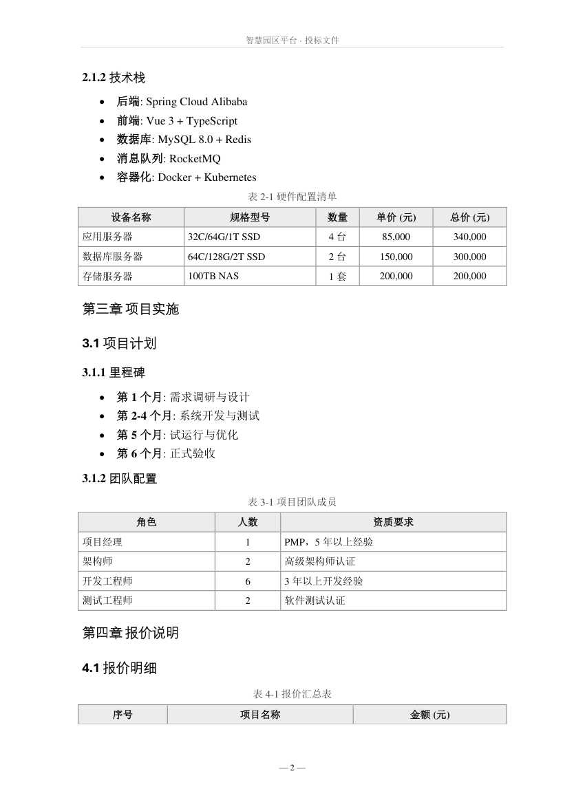
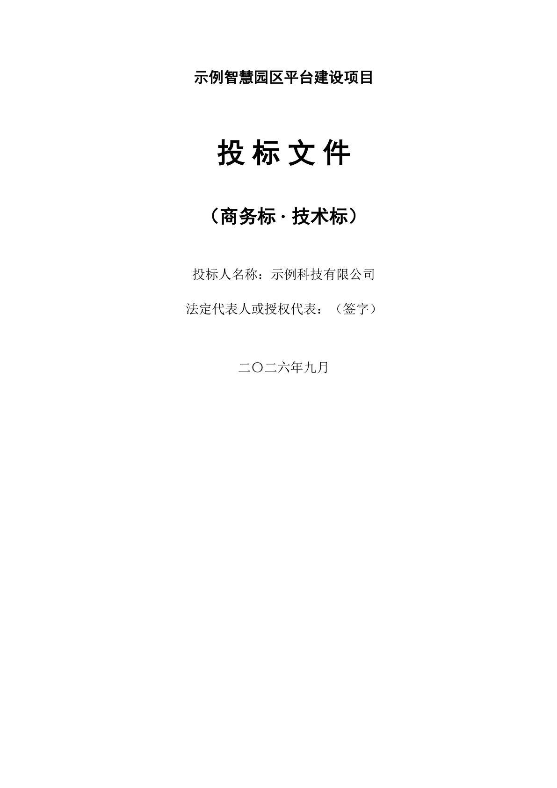
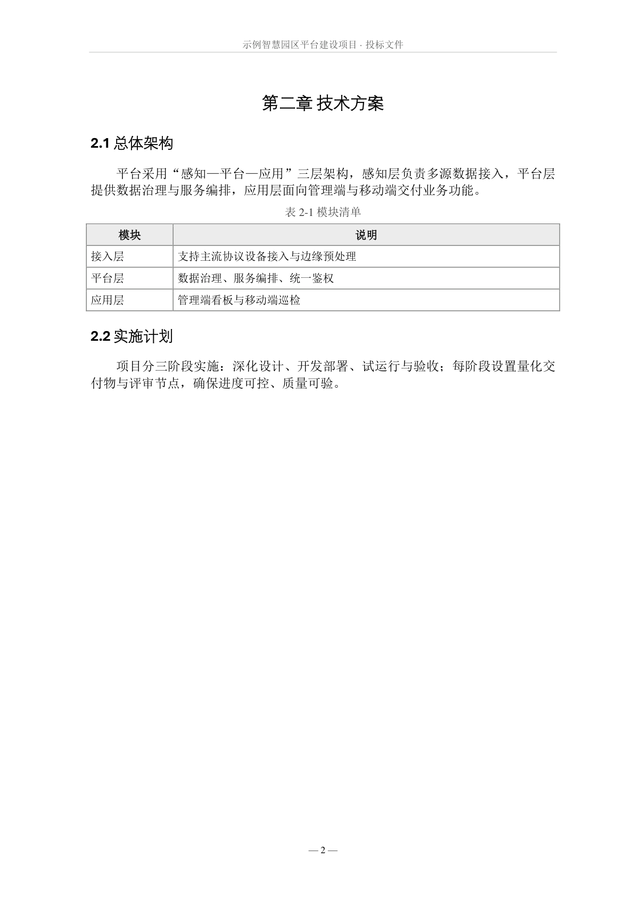

# Showcase — a tender, from Markdown to verified evidence

One document, traced end to end. This is **not a tutorial** — it is the proof that
the pipeline closes: a hand-written Markdown spec goes in, and a typeset, renderer-accepted
document comes out carrying its own machine-readable receipt.

The source lives in [`examples/tender/`](../examples/tender/) and runs with a single command.

---

## 1 · Input — what you author

You write plain Markdown. No styling, no layout, no Word. A table is a pipe table; a
caption is a line that starts with `表 1-1`; the structure *is* the intent.

```markdown
表 1-1 商务条款响应表

| 条款 | 招标要求 | 投标响应 |
|:---|:---|:---|
| 工期 | 90 日历天 | 完全响应 |
| 质量要求 | 符合国家验收标准 | 完全响应 |
| 付款方式 | 按招标文件 | 完全响应 |
```

A small `config.json` declares the document's identity — cover lines, running header,
and the layout contract (page-number format, table borders, header shading, caption gray):

```json
{
  "cover": [["CoverTitle", "投 标 文 件"], ["CoverSub", "智慧园区平台建设项目"], ...],
  "header": "智慧园区平台 · 投标文件",
  "style": { "page_number": "— {n} —", "table_border": "full", "table_shade": "EDEDED" }
}
```

## 2 · Compile — one command

```powershell
python scripts/render.py --src examples/tender --out bid.docx `
    --config examples/tender/config.json --pdf --check
```

Behind that flag chain:

| Stage | What it does |
|---|---|
| merge | Concatenate the Markdown sources in order |
| pandoc | `--reference-doc assets/ref.docx` + `--lua-filter captions.lua` — captions are marked at the AST level, never guessed with regex |
| `post.py` | Inject the cover, the TOC field, per-section page numbers, headers/footers, table rules, caption styling — hand-written OOXML in ECMA-376 element order |
| `finalize.py` | Open in the **real renderer** (Word by default), refresh the TOC field, export PDF |
| `validate.py` | Run the nine acceptance checks and write the evidence package |

## 3 · Output — what the client opens

Same words. Now with the template's borders, header-row shading, a centred caption,
section page numbers and a live TOC field — the part that used to eat an afternoon:



## 4 · Verify — nine checks, four states

Every delivery is checked, not assumed. Each check reports `PASS` / `FAIL` / `SKIP` / `ERROR`;
`SKIP` means a precondition was missing and is **never counted as passed** — only `FAIL` /
`ERROR` set exit code 1.

| Check | What it proves |
|---|---|
| `package_integrity` | The docx is a valid OOXML package that opens |
| `source_content` | Rendered content matches the Markdown source (when a source is supplied) |
| `image_embedding` | Referenced images are embedded, not linked or dropped |
| `section_count` | Section structure survived compilation |
| `toc_field` | The TOC is a real updatable field, not static text |
| `page_numbering` | Per-section page numbers resolved |
| `blank_pages` | No stray blank pages in the PDF |
| `renderer_acceptance` | The chosen renderer opened it without error |
| `visual_drift` | Page pixels match the recorded baseline |

Point it at a corrupted docx and `package_integrity` fails immediately while the PDF-derived
checks auto-skip — the validator does not lie to look green. Full detail: [VALIDATION.md](VALIDATION.md).

## 5 · Evidence — the receipt

The run ships a structured `report.json`, sampled page screenshots, and a SHA-256 manifest.
Shape of a passing report — field names identical to any real run:

```json
{
  "checks": {
    "package_integrity":   { "status": "PASS" },
    "image_embedding":     { "status": "PASS" },
    "toc_field":           { "status": "PASS" },
    "page_numbering":      { "status": "PASS" },
    "blank_pages":         { "status": "PASS" },
    "renderer_acceptance": { "status": "PASS" }
  },
  "summary": { "total": 9, "passed": 7, "failed": 0, "skipped": 2 }
}
```

Sampled pages from the evidence package:

 

Re-exporting the same layout through the same renderer measures **0.00 %** pixel drift
against `baselines/word/`. That number is the whole point: the document is not only
generated, it is *verified*.

---

## Reproduce it

```powershell
python scripts/render.py --doctor                 # is my environment ready?
python scripts/render.py --src examples/tender --out bid.docx `
    --config examples/tender/config.json --pdf --check
```

DOCX generation is cross-platform; the `--pdf` / renderer-acceptance half needs a renderer
(Word, WPS, or LibreOffice). The gallery and hero images regenerate deterministically with
`python scripts/make_previews.py` and `python scripts/make_hero.py`.
